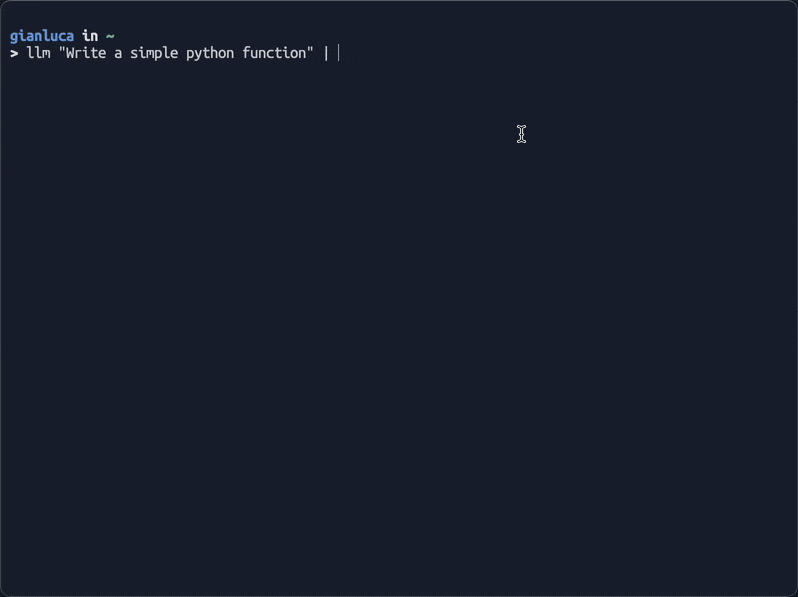
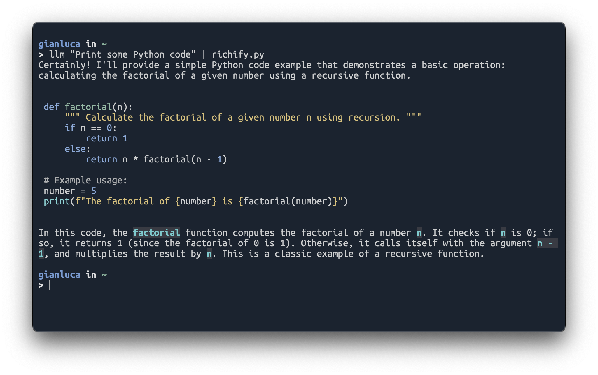
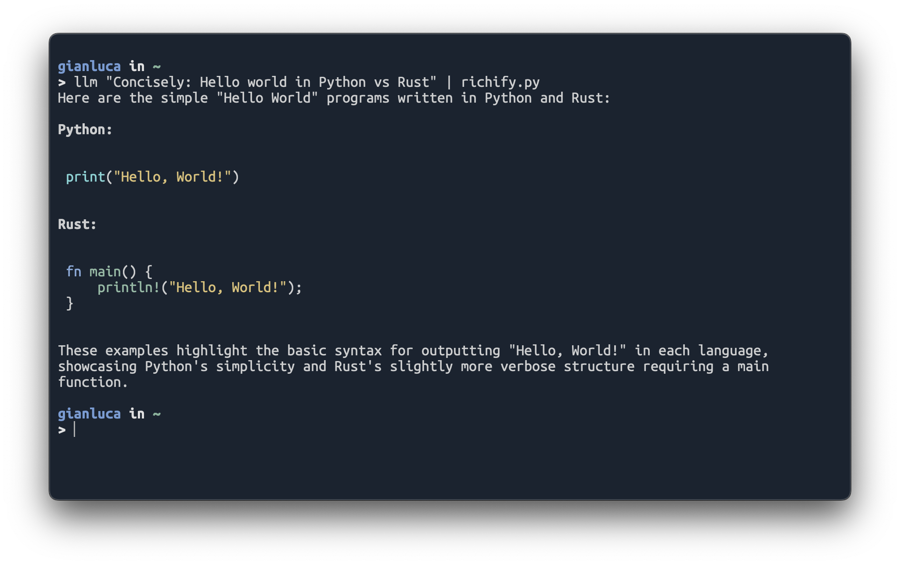

# Richify.py: Markdown Live Renderer

A real-time Markdown rendering tool that supports streaming input. 
Built with Rich and designed to run with uv.

 

Original inspiration: [this comment](https://github.com/simonw/llm/issues/12#issuecomment-2558147310).
For non-streaming use cases, consider using [rich-cli](https://github.com/Textualize/rich-cli/) instead.


## Usage

Run the script directly with uv:
```bash
# Show help
./richify.py

# Pipe content
echo "# Hello" | ./richify.py

# Render a file
cat README.md | ./richify.py
```

Stream [LLM](https://github.com/simonw/llm) response (the original use case):

```bash
llm "Write some markdown with code snippets" | ./richify.py
```

(Note: Several [attempts](https://github.com/simonw/llm/pulls?q=is%3Apr+rich) have been made by myself and others to incorporate this [much-requested](https://github.com/simonw/llm/issues/12) functionality directly into Simon's LLM tool, but he never reviews or acknowledges the PRs, so we made a workaround.)

- [Rich markdown formatting (including streaming) in any mode with --rich by gianlucatruda · Pull Request #571 ](https://github.com/simonw/llm/pull/571)
- [rich printing by juftin · Pull Request #278](https://github.com/simonw/llm/pull/278)
- [Markdown renderer support · Issue #12](https://github.com/simonw/llm/issues/12)

## How It Works

The script uses uv's script runner mode and automatically handles dependencies. No separate installation step is needed!

The script automatically:
- Detects if it's receiving piped input
- Shows help text when run without input
- Handles Unicode and encoding errors
- Maintains consistent markdown styling

Richify uses several key components to render Markdown in real-time:

- **Rich**: For beautiful terminal formatting and Markdown rendering
- **Live Display**: Updates the rendered content in real-time as new text arrives
- **Signal Handling**: Gracefully handles Ctrl+C and termination signals
- **Streaming Input**: Processes input character-by-character for smooth updates

The script automatically manages its dependencies through uv using the script header.

## Installation

1. First, [install uv](https://docs.astral.sh/uv/getting-started/installation/) if you haven't already:

2. Clone this repository:
```bash
git clone https://github.com/gianlucatruda/richify.git
cd richify
```

3. Convert `richify.py` to an executable script:
```bash
chmod +x richify.py
```

4. (Optional) Move the executable to somewhere in your `PATH`:

For example on macOS 

```bash
sudo cp richify.py /usr/local/bin/
```

Now you can invoke it with `richify.py` from anywhere.


 
 

